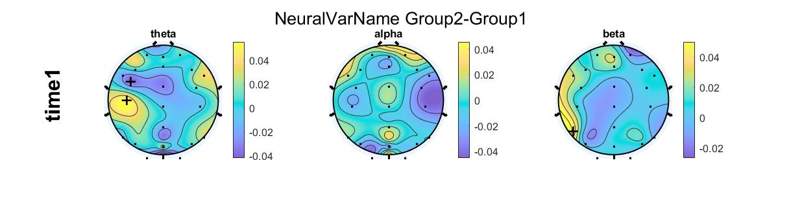
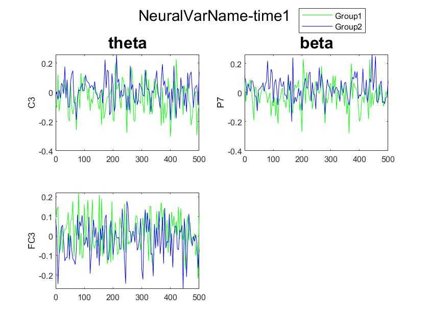
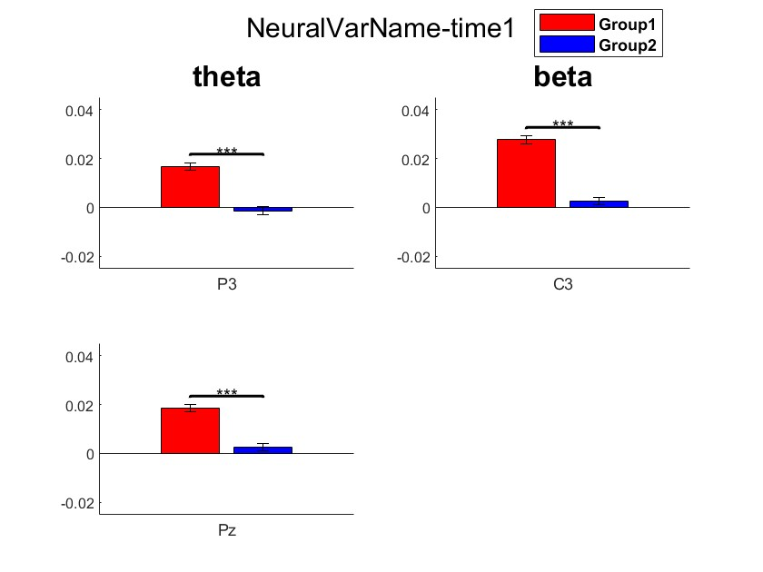
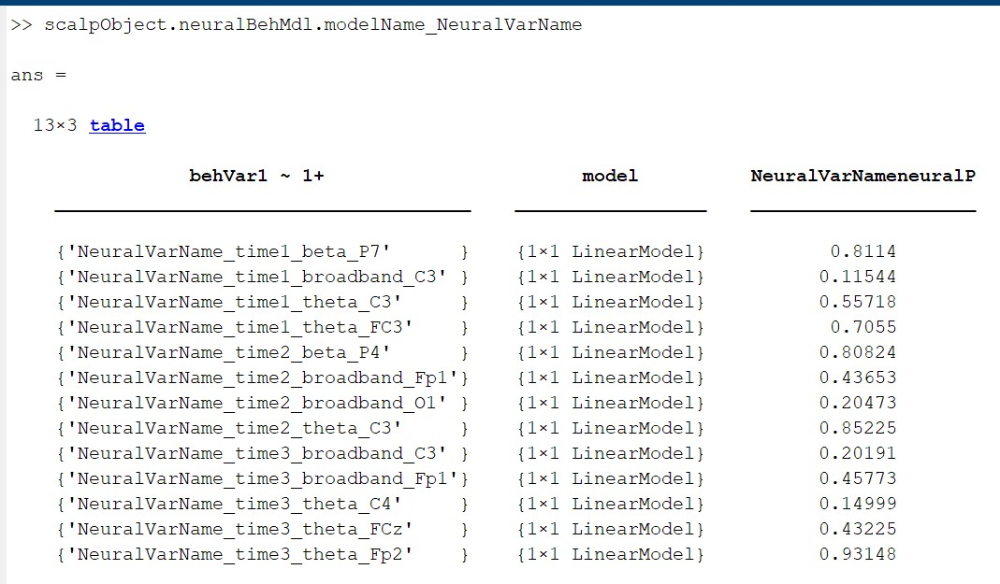
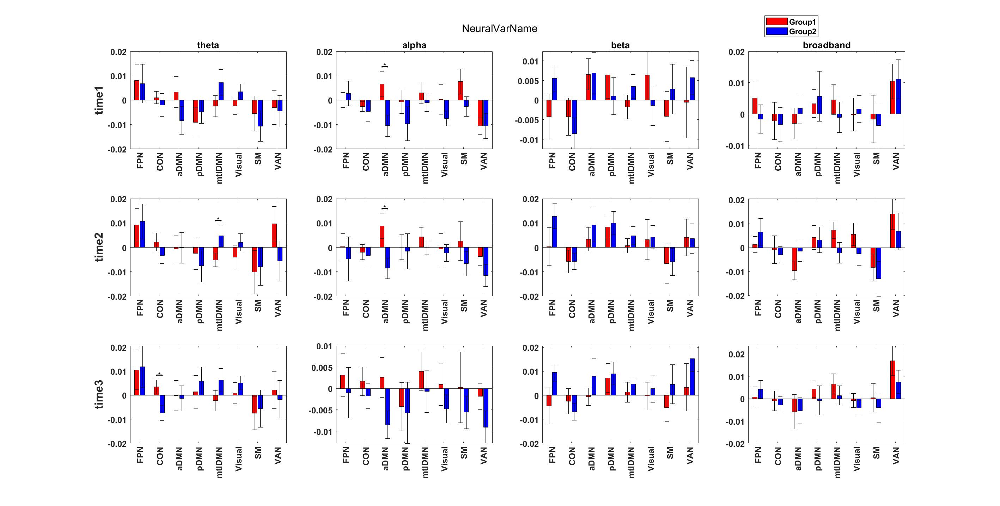
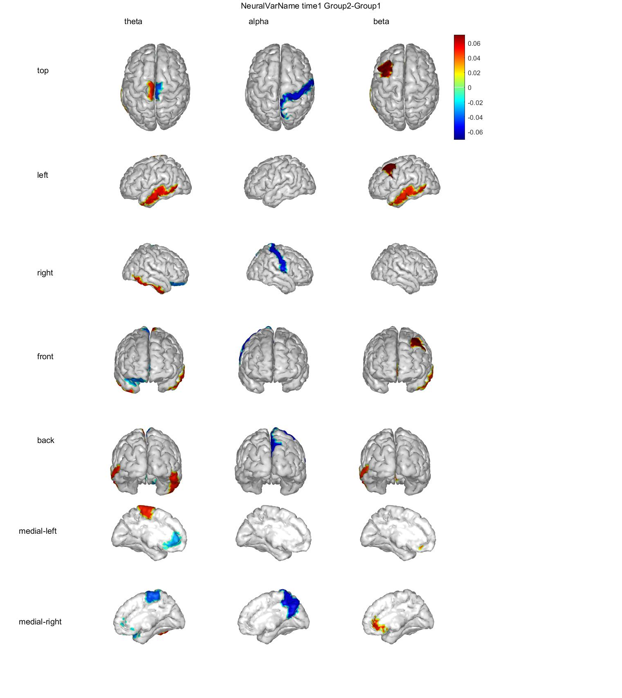

# Automated-Analysis-of-EEG

This repo is meant to streamline ERP, ERSP, and source localized analysis for any task design and data visualization purposes. 

## Getting Started

Download or clone the entire repo to your computer.

## Files

- **scripts/DataAnalysis:** This folder has all the source code for the analysis.
- **scripts/runERP.m:** Sample script for running ERP and Source localized analysis
- **scripts/runERSP.m:** Sample script for running ERSP analysis 
- **sample.mat:** Sample data in the proper format used with runERP.m


## Useage

#### Formatting Input data

Start with empty structure: ex: project=struct()

##### Info
- **project.info.experimentalDesign**: A string of either 'paired' or 'twoSample' denoting which t-test to perform.
- **project.info.freq_list**: A cell array of frequency names in the same order as the dataset, e.g., `{'theta', 'alpha'}`.
- **project.info.timeAxis**: A 1xT vector of timestamps in milliseconds (ms) corresponding to the datapoints.
- **project.info.groupNames**: A cell array of the names of the groups in the dataset, e.g., `{'Group1', 'Group2'}`.
- **project.info.**: A cell array of variable names.
- **project.info.**: The channel locations of your EEG data from EEGLAB.
- **project.info.**: For source processing, a cell array of the names of the ROIs from BSBL.

##### DATA
A structure containing the data, where each field represents a different group.

- **EX**: `DATA.Group1` would be a structure for the 'Group1' group, and `DATA.Group2` would be for the 'Group2' group.

Each group structure contains the following fields:

- **project.scalpData.(group).Groupname**: A string representing the group name.
- **project.scalpData.(group).VarName**: A matrix of size [F frequencies, C channels, T time points, N subjects].
-- Can have as many VarName variables as you want. This will test everything.

## Example Structure
If you have two variables ('var1' and 'var2') and two groups ('Group1' and 'Group2'), the structure would look like this:

project.scalpData.Group1.groupName = 'Group1'

project.scalpData.Group1.var1 

 - [F, C, T, N] matrix for var1 in group1

project.scalpData.Group1.var2

- [F, C, T, N] matrix for var2 in group1

project.scalpData.Group1.subList={'sub1','sub2',...}

project.scalpData.Group2.groupName = 'Group2'

project.scalpData.Group2.var1   

- [F, C, T, N] matrix for var1 in group2

project.scalpData.Group2.var2   

- [F, C, T, N] matrix for var2 in group2

project.scalpData.Group2.subList={'sub1','sub2',...}

project.info.experimentalDesign = 'twoSample'

- 'twoSample' or 'paired'

project.info.freq_list={'Alpha','beta'}

- Specifies 'F' as having two frequencies, alpha and beta

project.info.chanlocs = chanlocs Structure from EEGLAB

project.info.timeAxis=[-500:4:1500]

- specifies timeAxis in 'T' ranges from -500ms to 1500ms in steps of 4mS (250Hz sample rate)

project.info.groupNames = {'Group1','Group2}

- **MUST** match the groupnames in the data structures

project.info.variables = {'var1','var2'}

- **MUST** match the variable names in the data structures

project.info.roi = cell array of ROI names if using source localization

#### Defining specifications

##### Baseline
baselineTime=[baselineStart baselineEnd]

- Specifies baseline correction in mS. Ex; baselineTIme=[-250 -50] will baseline correct based on -250mS to -50mS time window

##### timeRange

Structure specifying different time ranges
```
timeRange=struct();
timeRange.time1=[0 500];
timeRange.time2=[500 1000];

```
Specifies two time windows of interest, time1 is 0-500mS, time2 is 500-1000 mS

##### Behavior Table
Table with behavior metrics if neural behavior analysis is needed. 

```
| Subject | BehaviorVar |
|---------|-------------|
| Sub1    |     ###     |
| Sub2    |     ###     |
```


## Scalp Analysis 

```
scalpObject=ScalpObject(project.scalpData, project.info, baselineTime, timeRange); # Initialize scalp processing
scalpObject = scalpObject.cleanDatasets(); # remove any missing subjects if any from Scalp data
scalpObject = scalpObject.standardProcessing(); # standard processing pipeline, 5SD outlier, baseline correction
scalpObject = scalpObject.ScalpAnalysis(); # calcualtes all significant electrodes between groups across all conditions
# Transforming data 
#func=@(x) abs(hilbert(x));
#scalpObject = scalpObject.applyFunc(func);
scalpObject = scalpObject.calSigTbl('sig'); # creating table of significant neural attributes

```
## Scalp Plotting

```
# specifying what conditions to plot
vars2plot={'var1'}; 
freq2plot={'beta'}; 
times2plot={'time1'}; 
errorType='sem'; 
chans2plot={'Pz'}; 

scalpObject.plotScalpMap('vars2plot',vars2plot,'freq2plot',freq2plot,'times2plot',times2plot,'combinations',[1,2]); # plot scalp topo map

scalpObject.plotERPs('vars2plot',vars2plot,'freq2plot',freq2plot,'times2plot',times2plot) # plot ERP traces of significant electrodes

scalpObject.plotScalpBar('vars2plot',vars2plot,'freq2plot',freq2plot,'times2plot',times2plot)
 # plot group bar plots of significant electrodes 
```

## Neural Behavior Analysis with fitlm
```

neuralVar={'NeuralVarName'}; % Specify here
baseModel="behVar1 ~ 1+ "; % define model for fitlm - automatically appends neuralVar
keyColumnName='Subject'; % column name with subjectIds
scalpObject=scalpObject.NeurBehMdl(neuralVar,behTbl,keyColumnName,baseModel,'modelName');
scalpObject.neuralBehMdl.modelName_NeuralVarName = extractp(scalpObject.neuralBehMdl.modelName_NeuralVarName,"NeuralVarName",1); % extract all p-values from fitlm

```

## Source Localized Analysis
**Must have https://github.com/aojeda/dsi installed for visualization**

Same format as Scalp analysis and plotting
```
sourceObject=SourceObject(project.sourceData, project.info, baselineTime, timeRange);
sourceObject = sourceObject.cleanDatasets(); 
sourceObject = sourceObject.standardProcessing();
sourceObject = sourceObject.SourceAnalysis();
sourceObject = sourceObject.calSigTbl();

%% Source Plotting
sourceObject.plotNetwork(netwrk,vars2plot); % grouped network bar plots for specified measure
sourceObject.plotBrainmap('vars2plot',vars2plot,'freq2plot',freq2plot,'times2plot',times2plot,'combinations',[1,2]); % full roi plot for specified measure
```

## Results from runERP.m with sample.mat



Scalp Topography showing Group2-Group1 activity. Three frequency bands are shown and one time range is shown from the specifications inputted. '+' indicates significant electrodes.



ERP's of significant electrode seen in Fig1. One Figure is shown for 'time1' from specifications.



Bar plots in the same format as Fig2



Screengrab of the output of neural behavior model.
 - First column indicates the specific neural variable plotted. Ex:  NeuralVarName_time1_beta_P7 is 'neural variable' 'time window' 'freq band' 'electrode' 
 
- Second column has the fitlm model
- third column is getting specific p value from the model as defined in 

'scalpObject.neuralBehMdl.modelName_NeuralVarName = extractp(scalpObject.neuralBehMdl.modelName_NeuralVarName,"NeuralVarName",1); % extract all p-values from fitlm'



Source localized network data in grouped bar plots



Source localized brain maps showing regions of significant differences between the groups

## Other Features
1. More functionality found in the source code
2. Can be run for any number of groups, variables, frequency bands, and time ranges.

## 📄 License

This project is licensed under the MIT License. See the [LICENSE](./LICENSE) file for details.

## 📖 Citation

If you use this work, please cite:

> Nan, J., et al. (2025). *Climate trauma from wildfire exposure impacts cognitive decision-making*. Scientific Reports.  
> [https://doi.org/10.1038/s41598-025-94672-0](https://doi.org/10.1038/s41598-025-94672-0)

<details>
<summary>BibTeX</summary>

```bibtex
@article{nan2025,
  author    = {Nan, Jason and others},
  title     = {Title of the paper},
  journal   = {Scientific Reports},
  year      = {2025},
  volume    = {},
  number    = {},
  pages     = {},
  doi       = {10.1038/s41598-025-94672-0}
}


